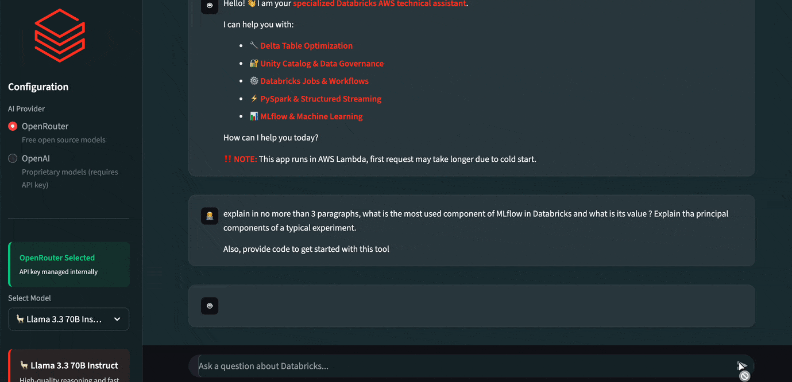
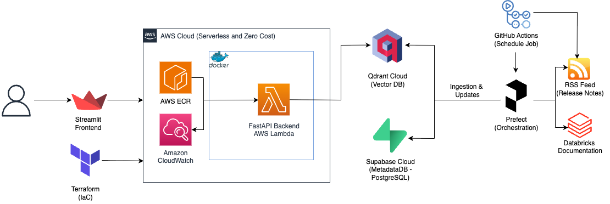

<div align="center">

# RAG-DATABRICKS-EXPERT

<p>
  
  
  
  
  
  
  </p>
<p>
  
  
  
  
  
  
  
</p>

</div>

---

A production level GenAI assistant engineered to query and synthesize technical information from Databricks AWS documentation and release notes. Demonstrating a reusable and extensible design applicable to other clouds or technical tools, this project demonstrates a complete **End-to-End MLOps lifecycle**: from automated data ingestion pipelines and hybrid vector retrieval to a serverless, containerized deployment on AWS. The system is designed with a decoupled architecture, separating the ingestion logic from the inference API, while leveraging a multi-service cloud architecture designed for zero operational cost.

<div align="center">
  
</div>

### Why a RAG Expert on Databricks?

Inspired by enterprise-grade tools like the **Databricks Assistant**, I aimed to reverse-engineer the architectural challenges of building a context-aware AI for technical documentation while learning modern MLOps practices, RAG patterns, and cloud-native deployments. This project serves as a reference implementation for building robust, scalable RAG systems using modern MLOps practices. 

I chose Databricks documentation due to its rich technical content and constant updates, making it an ideal candidate for demonstrating dynamic knowledge retrieval. Moreover, Databricks' prominence in the data engineering and machine learning space makes it a great opportunity to learn aspects of their platform while building and testing the assistant.

This project focuses on **Engineering and Production Level practices**:
* **Beyond Static Data:** Instead of just performing a documentation one-time load, it implements a **daily automated pipeline** (orchestrated by Prefect and executed by GitHub Actions) that listens to RSS feeds to ingest Release Notes, ensuring the model's knowledge remains fresh.
* **Hybrid Search and RFF:** Implements a Hybrid Retrieval strategy (sparse/keyword search combined with dense/vector search) for precise context fetching, enhanced by Re-ranking and Filtering (RFF) to optimize the final set of retrieved documents before prompt injection.
* **Infrastructure as Code:** The cloud environment is not manually configured but provisioned via **Terraform** and automated with a **Makefile**, ensuring reproducibility.
* **Serverless Efficiency:** The core inference engine runs on **AWS Lambda** via **Docker** containers in **AWS ECR**, optimizing cost and auto-scaling capabilities.

---

## ☁️ Cloud Architecture

<div align="center">
  
</div>

---

## Technological Stack

The project leverages a modern, high-performance stack chosen for performance, scalability and a zero operational cost.

| Technology | Role | Description in Project |
| :--- | :--- | :--- |
| **Qdrant** | Vector DB | Stores dense vector embeddings for semantic search and sparse embeddings for keyword search. Enables fast retrieval of relevant documentation chunks. |
| **Supabase** | Metadata DB | PostgreSQL-based storage for structured metadata (URLs, titles, number of chunks), enabling deduplication and updates management. |
| **Prefect** | Orchestration | Manages and monitors the data engineering pipelines: batch loading of documentation and incremental updates via RSS feeds. |
| **GitHub Actions** | Scheduled Job | Daily executes the release notes incremental update pipeline while being tracked by Prefect.  |
| **FastAPI** | Backend API | High-performance, async REST API handling inference requests. It acts as the orchestration layer between the user, the VectorDB, and the LLMs. |
| **OpenAI API** | LLM Provider API | The OpenAI API provides the OpenAI (propietary) and OpenRouter (open source) language models that will be used for generation. |
| **Docker** | Containerization | Ensures consistency across development and production. Used to package the API. |
| **Terraform** | IaC | Provisions the AWS infrastructure (ECR repositories, Lambda functions, IAM roles) as code. |
| **AWS Lambda** | Compute | Hosts the containerized FastAPI backend. Chosen for its serverless, event-driven scaling capabilities at a low cost. |
| **Streamlit** | Frontend | AI-Accelerated UI. A custom chat interface **developed using LLM coding assistants** to rapidly iterate on UX features while maintaining focus on backend architecture. |

---

## 📂 Project Structure

The repository separates concerns between infrastructure, source code, and data layers.

```bash
RAG-Databricks-Expert/
├── .github/                             # GitHub repository configuration
│   ├── workflows/           
│   │   ├── release_notes_ingestion.yml  # Workflow for daily data ingestion pipeline
├── frontend/                            # Streamlit User Interface 
├── src/
│   ├── backend_api/                     # FastAPI application (Lambda function)
│   │   ├── core/                        # RAG & LLM Providers logic
│   │   ├── models/                      # Pydantic models
│   │   ├── routes/                      # API query endpoints for generation and streaming
│   │   ├── main.py        
│   │   └── ...
│   ├── ingestion_pipeline/              # Prefect flows (Batch & RSS)
│   ├── db/                              # DB clients (Qdrant/Supabase)
│   └── utils/                           # API logger
├── supabase/
│   ├── migrations/                      # SQL migrations for metadata schema
│   └── ...
├── terraform/                           # Terraform configuration (IaC)
│   ├── main.tf
│   └── ...
├── .dockerignore                        # Files and directories to exclude from Docker build                     
├── .env.example                         # Template for required environment variables
├── .gitignore               
├── .python-version          
├── docker-compose.yml                   # Local Qdrant DB for development and testing
├── LICENSE                  
├── Makefile                             # API Cloud Automation scripts
├── pyproject.toml                       # Project dependencies (managed by uv)
├── README.md                
└── uv.lock                              # Locked file for reproducible environment dependencies